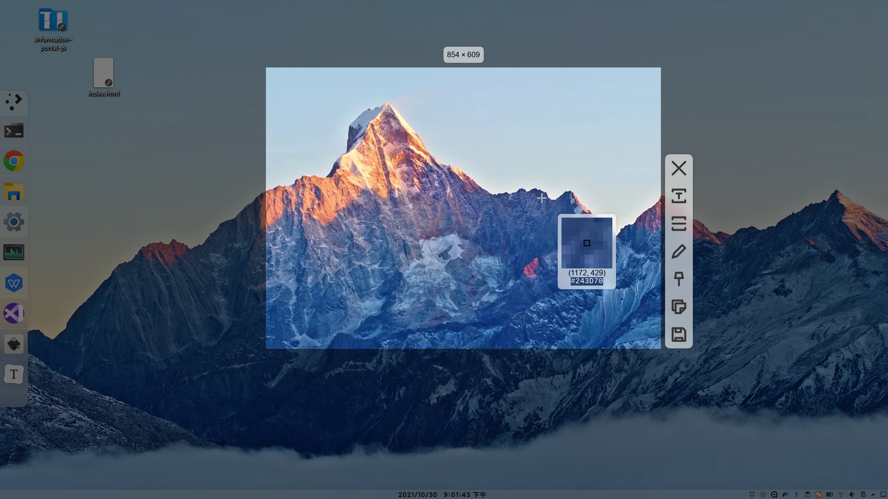
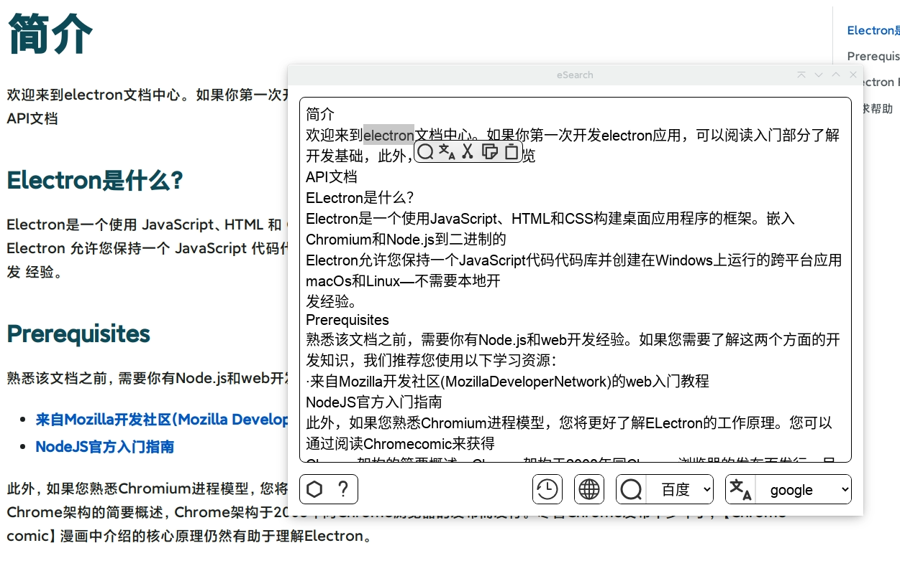

# eSearch


## 简介

eSearch是[Information-portal](https://github.com/xushengfeng/Information-portal.git)的:electron:重写版(顺便加了些功能)

主要是想在Linux上(win,mac理论上能用)实现[锤子大爆炸](https://www.smartisan.com/pr/videos/bigbang-introduction)或[小米传送门](https://www.miui.com/zt/miui9/index.html)这样的屏幕搜索功能





## 安装

在右侧releases打开标签，选择符合你系统的包并下载安装

国内快速下载链接：[Releases · xushengfeng/eSearch · fastgit](https://hub.fastgit.org/xushengfeng/eSearch/releases)

## OCR服务

确保你的电脑安装了python

```shell
python serve.py
```

## 源码运行&编译

```shell
git clone https://github.com/xushengfeng/eSearch.git
cd eSearch
npm install
# 运行
npm start
# 编译
npm run make
```

## 启动

在你的启动器打开eSearch,他将出现在托盘.Gnome用户需要安装[appindicator](https://extensions.gnome.org/extension/615/appindicator-support/)插件

默认快捷键为<kbd>Ctrl</kbd>+<kbd>Shift</kbd>+<kbd>Z</kbd>(你也可以在设置设置快捷键)

## 功能

- [x] 截屏
  - [x] 框选裁切
  - [x] 框大小位置可调整(支持方向键或WASD)
  - [x] 取色器
  - [x] 放大镜
  - [x] 画笔
  - [ ] 画笔撤销
  - [x] 色板
  - [ ] 笔画粗细
  - [ ] 鼠标拖动画几何
  - [ ] 高级几何设置
  - [ ] 图像滤镜
- [x] 保存
- [x] 复制到剪贴板
- [x] 钉在屏幕上
  - [x] 滚轮缩放
  - [x] 恢复默认大小位置
  - [x] 透明度
- [x] 二维码识别
- [x] OCR识别
  - [x] 本地OCR
  - [x] 百度OCR
  - [ ] OCR插件
- [ ] 以图搜图
- [x] 托盘
- [x] 系统选中搜索
- [x] 识别展示
  - [x] 自动搜索翻译
  - [x] 搜索
  - [x] 翻译
  - [x] 内部打开
  - [x] 浏览器打开
  - [x] 链接识别
  - [ ] 历史记录
- [ ] Wayland桌面:sweat_smile:(为什么electron截不了wayland!)
- [ ] 独立于electron的截图api

## 测试

在ArchLinux,KDE plasma,Xorg下测试通过
Windows暂时无法解决截屏截到光标问题
Gnome暂时无法解决截屏截到光标问题
Wayland无法截图

## 开发原因

我在用Windows时一直用这个好用的截图软件：[Snipaste - 截图 + 贴图](https://zh.snipaste.com/)，但我现在切换到Linux，Snipaste不支持，所以我选择了[Flameshot](https://flameshot.org/)，很可惜它不支持取色器。

促使我开发eSearch的另一个契机是我很享受在手机上使用[锤子大爆炸](https://www.smartisan.com/pr/videos/bigbang-introduction)或[小米传送门](https://www.miui.com/zt/miui9/index.html)这样的即时信息搜索工具，但我没有找到电脑上类似的代替品。

所以我干脆自己开发一个“截图+OCR+搜索+贴图”的软件。最开始用python+pyqt开发出[Information-portal](https://github.com/xushengfeng/Information-portal.git)，但因为我不熟悉pyqt，所以我转战:electron:，开发出本软件。:smile:
