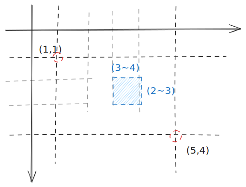
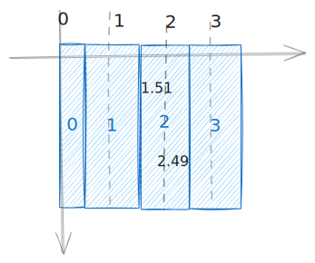
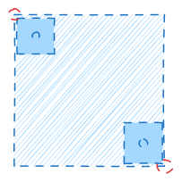
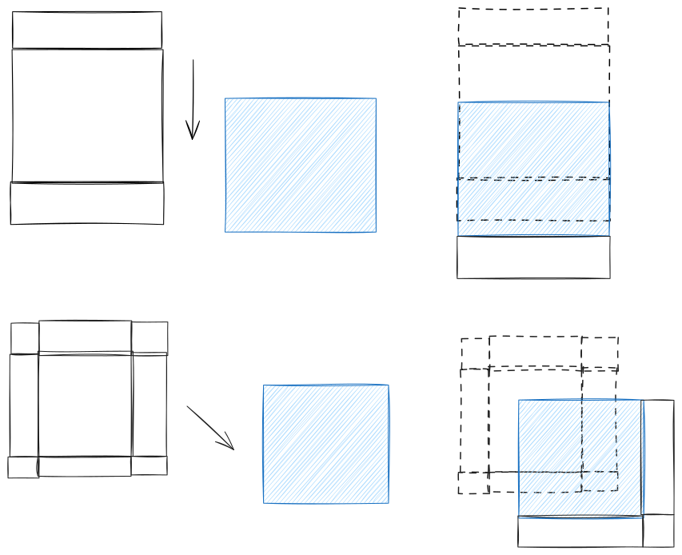

# 截屏

使用`node-screenshot`库，Wayland 平台调用了桌面的截屏软件，再读取图片，所以会有些慢。由于该库暂不支持 Linux Arm64，所以我在 nodejs 下模仿类似的操作，读取设置里的命令，调用外部截屏软件，然后读取图片。

## 坐标

canvas 坐标与数学上的一致，在左上角的一个像素点应为`(0, 0)` `1x1`的矩形。包括图片的裁切，实际上是 canvas 上的整数矩形坐标。这些整数坐标描述了整数方格的一个个交点。对于框选和获取元素定位来说，这些**数学坐标**是最重要的。所以理论上，大小栏和鼠标跟随栏的坐标应该是数学坐标，放大镜的中心点应为相交线。

而我们需要的取色器却要获取一个像素点的信息，准确来说，是一个范围，一个 1x1 的矩形，也可以近似为 n.5 的信息，我们可以把他成为**像素坐标**。在取色器上，此时的坐标又应该是像素坐标，放大镜中间应该是中心像素。

我们可以发现，数学坐标和像素坐标这两个看似矛盾的概念在逻辑上可以相互转化，如果我们以数学坐标（整数，落在像素顶点上）为准，那这个坐标周围的四个像素就可以是取色目标；如果我们以像素坐标为准，那这个像素矩形的四个顶点也表示了四个数学坐标。后一种方式是**eSearch**的逻辑。然而在开发初期，一直到现在，都要面临鼠标事件的不准确问题。

在 Chrome 126（Linux Wayland）实验可知，鼠标事件的坐标都是整数，应该是经过`math.round`转换后的数学坐标。比如$(1.5, 2.5)$都被映射成$2$。我们需要的整数数学坐标直接使用鼠标事件的坐标即可。

至于像素坐标，由于鼠标事件无法提供精确的坐标，所以我们似乎无法计算。在画布缩放==1 时，我们可以简单地用鼠标事件坐标表示，可以映射所有像素，肉眼也看不出差别。但缩放!=1 时，特别是>1 时，我们可以看到鼠标所在图片像素的位置，这就需要精准计算了，可以获取鼠标在屏幕上的坐标（`offsetX`在`scale`的画布上也近似了），通过缩放转化计算，我们可以获取高精度的数学坐标，通过`Math.floor`或`Math.ceil`取整，得到像素坐标。

说完具体实践，我们再说回理论，尽管数学坐标和像素坐标可以相互转化，但他们都有四种情况，如何使用和显示？**eSearch**像素坐标优先，因为放大后像素本身比像素顶点更明显，鼠标指在像素上，交互也应该是像素坐标才对。在取色、框选等输入交互中使用像素坐标，而代码处理都是使用数学坐标。因此绘制矩形框选需要数学坐标，取框选前后两个像素的外框作为几个数学坐标。

自由框选就不能这么做了，所以直接用像素左上角的数学坐标即可。大小栏不直接参与交互，显示数学坐标即可。鼠标跟随栏上的坐标，同样用像素左上角的数学坐标，这样会导致不从左上角开始的框选显示坐标和框选坐标有出入。

## 广截屏

即滚动截屏

思路：获取滚动前后位移，拼接

由于我们很难通过系统 API 层面获取滚动的像素，比如一些网页可以监听滚动事件自己设置滚动距离，所以我们通过分析图片来获取滚动距离。

需要至少两张截屏图片，一张滚动前，一张滚动后。使用`uiohook-napi`获取鼠标滚动事件和方向键，也可以定时截屏。

可以通过特征点算法来分析图片位移，但`opencv.js`没有提供，所以我只使用了最简单的模板匹配算法。

由实践可知，模板需要小于源图片大小，否则匹配结果不准确，所以我们需要裁切第二张图片。

还要考虑的是一些界面有固定元素，比如导航栏等，我们可以通过异或算法来消除这些固定元素，但在 eSearch 中，我使用了简单的裁切，一般固定元素在图片四周，所以我们自己裁切，大部分情况下效果不错。

举个例子：有“目”字形的页面结构，第 1、3 个“口”可能是固定元素，第 2 可能是滚动元素。我们预期得到一个中间长，上下固定元素均保留的长截屏。我们裁切第 2 作为模板，匹配上一张截屏，得到位移。如果位移向下，把 2、3 覆盖到上一张截屏，这样 1 保留，2 延伸，并覆盖了上一张的 3。其他方向同理，如果考虑上下左右滚动的广截屏，以九宫格来切割。

